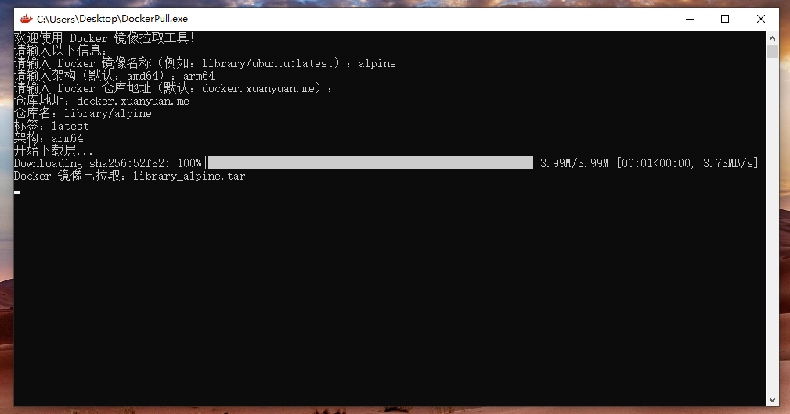

# Docker Image Puller

## 项目简介

Docker Image Puller 是一个方便的工具，用于从 Docker 仓库拉取镜像，支持国内镜像源加速和多架构支持。该工具采用 MIT 许可证，开放源代码，方便用户根据需要进行定制和扩展。

## 特点

- **无需安装 Docker 或 Python 环境**：直接使用单文件 EXE 或 Python 脚本，开箱即用。
- **无依赖 EXE 执行**：编译为独立 EXE 文件，无需安装 Python 环境，无需安装 Docker 环境，直接在 Releases 下载就能直接使用。
- **国内镜像源加速**：通过配置国内镜像源，大幅提高镜像下载速度，解决国内无法直接下载的问题。
- **多架构支持**：支持多种架构（如 `amd64`、`arm64`），满足不同环境需求，尤其是 arm64 内网服务器。
- **兼容最新 Docker Hub API**：确保与 Docker Hub 的最新接口兼容，获取最新的镜像信息。
- **单文件 Python 脚本**：便于携带和使用，无需复杂安装。
- **用户友好**：提供交互式输入，简化操作流程。
- **优化性能**：提高下载速度和可靠性。


## 截图：




## 安装

### 下载 EXE 文件

前往 [Releases](https://github.com/topcss/docker-pull-tar/releases) 页面，下载 `DockerPull.exe`，无需安装任何依赖，直接运行。


### 通过 Git 克隆

```bash
git clone https://github.com/topcss/docker-pull-tar.git
```

### 基本用法

```bash
python docker_image_puller.py [镜像名称] [架构] [仓库地址]
```

### 示例

#### 交互式模式

```bash
D:\> DockerPull.exe

欢迎使用 Docker 镜像拉取工具！
请输入以下信息：
请输入 Docker 镜像名称（例如：library/ubuntu:latest）：alpine
请输入架构（默认：amd64）：
请输入 Docker 仓库地址（默认：docker.xuanyuan.me）：
仓库地址：docker.xuanyuan.me
仓库名：library/alpine
标签：latest
架构：amd64
Docker 镜像已拉取：library_alpine.tar
```

#### 命令行模式

```bash
python docker_image_puller.py library/ubuntu:latest amd64 docker.xuanyuan.me
```

## 内网 Docker 导入方法

1. **拉取镜像并打包**  
   使用本工具拉取镜像并生成 `.tar` 文件，例如 `library_alpine.tar`。

2. **将 `.tar` 文件传输到内网机器**  
   通过 U 盘、内网文件服务器或其他方式将 `.tar` 文件传输到目标机器。

3. **导入镜像到 Docker**  
   在内网机器上运行以下命令导入镜像：

   ```bash
   docker load -i library_alpine.tar
   ```

4. **验证镜像**  
   导入完成后，运行以下命令查看镜像：

   ```bash
   docker images
   ```

   然后启动容器：

   ```bash
   docker run -it alpine
   ```

## 许可证

本项目采用 MIT 许可证，详情见 [LICENSE](LICENSE) 文件。

## 联系方式

如有任何问题或建议，请通过 [GitHub Issues](https://github.com/topcss/docker-pull-tar/issues) 提出。

## 为什么选择这个工具？

- **无需安装 Docker 或 Python**：直接运行 EXE 文件，适合内网环境。
- **速度快**：国内镜像源加速，下载更快。
- **架构灵活**：支持 `amd64` 和 `arm64` 架构，适应多种环境。
- **易于使用**：单文件脚本，无需复杂配置。
- **开放源代码**：自由定制和扩展。

## 常见问题

**Q**: 如何配置国内镜像源？  
**A**: 在命令行中指定仓库地址参数，例如 `docker.xuanyuan.me`。

**Q**: 支持哪些架构？  
**A**: 目前支持 `amd64` 和 `arm64` 架构。

**Q**: 是否需要安装 Docker 或 Python？  
**A**: 不需要！直接下载 `DockerPull.exe` 即可运行。

**Q**: 如何在内网中使用？  
**A**: 使用本工具拉取镜像并生成 `.tar` 文件，然后通过 `docker load` 命令导入内网机器。

---

希望通过这个工具能为您的 Docker 镜像管理带来便利！ 🚀

---

### 目录

- [Docker Image Puller](#docker-image-puller)
  - [项目简介](#项目简介)
  - [特点](#特点)
  - [截图：](#截图)
  - [安装](#安装)
    - [下载 EXE 文件](#下载-exe-文件)
    - [通过 Git 克隆](#通过-git-克隆)
    - [基本用法](#基本用法)
    - [示例](#示例)
      - [交互式模式](#交互式模式)
      - [命令行模式](#命令行模式)
  - [内网 Docker 导入方法](#内网-docker-导入方法)
  - [许可证](#许可证)
  - [联系方式](#联系方式)
  - [为什么选择这个工具？](#为什么选择这个工具)
  - [常见问题](#常见问题)
    - [目录](#目录)

---

如果有其他需求或需要进一步优化，请随时告诉我！ 😊