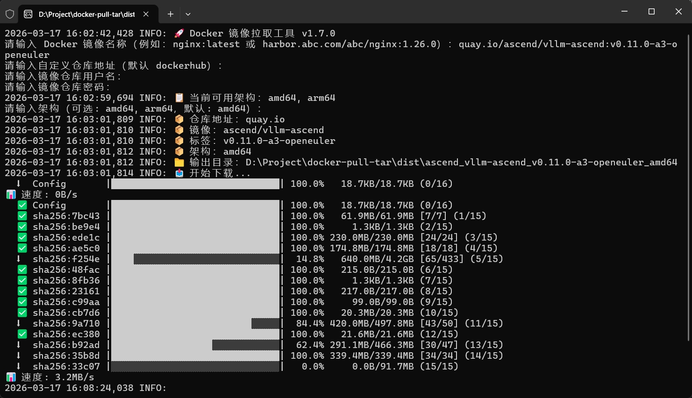

# Docker Image Puller

## 项目简介

Docker Image Puller 是一个方便的工具，用于从 Docker 仓库拉取镜像，支持断点续传、多架构选择。该工具采用 MIT 许可证，开放源代码，方便用户根据需要进行定制和扩展。

## 特点

- **无需安装 Docker 或 Python 环境**：直接使用单文件 EXE 或 Python 脚本，开箱即用。
- **无依赖 EXE 执行**：编译为独立 EXE 文件，无需安装 Python 环境，无需安装 Docker 环境，直接在 Releases 下载就能直接使用。
- **断点续传**：支持下载中断后继续下载，无需重新开始。
- **失败重试**：自动重试失败的下载，最大重试10次，确保下载成功。
- **SHA256 校验**：下载完成后自动校验文件完整性，确保镜像正确。
- **多架构支持**：支持多种架构（如 `amd64`、`arm64`），自动识别镜像可用架构并提示选择。
- **兼容最新 Docker Registry API**：确保与 Docker Hub、Quay.io 等镜像仓库的最新接口兼容。
- **单文件 Python 脚本**：便于携带和使用，无需复杂安装。
- **用户友好**：提供交互式输入，简化操作流程。
- **下载统计**：显示平均下载速度和总耗时。
- **自定义输出目录**：支持指定下载目录，默认输出到当前目录。

## 截图：



## 安装

### 下载 EXE 文件

前往 [Releases](https://github.com/Potterluo/docker-pull-tar/releases) 页面，下载 `DockerPull.exe`，无需安装任何依赖，直接运行。

### 通过 Git 克隆

```bash
git clone https://github.com/Potterluo/docker-pull-tar.git
```

## 使用方法

### 基本用法

```bash
DockerPull.exe [选项]
```

### 参数说明

| 参数 | 说明 |
|------|------|
| `-i, --image` | Docker 镜像名称（例如：nginx:latest 或 harbor.abc.com/abc/nginx:1.26.0） |
| `-a, --arch` | 架构，默认：amd64，常见：amd64, arm64 等 |
| `-r, --custom-registry` | 自定义仓库地址（例如：harbor.abc.com） |
| `-u, --username` | Docker 仓库用户名 |
| `-p, --password` | Docker 仓库密码 |
| `-o, --output` | 输出目录，默认为当前目录下的镜像名_tag_arch 目录 |
| `-q, --quiet` | 静默模式，减少交互 |
| `--debug` | 启用调试模式，打印详细日志 |
| `--workers` | 并发下载线程数，默认4 |
| `-v, --version` | 显示版本信息 |
| `-h, --help` | 显示帮助信息 |

### 示例

#### 交互式模式

```bash
D:\> DockerPull.exe

🚀 Docker 镜像拉取工具 v1.4.0
请输入 Docker 镜像名称（例如：nginx:latest 或 harbor.abc.com/abc/nginx:1.26.0）：alpine
请输入自定义仓库地址（默认 dockerhub）：
请输入镜像仓库用户名：
请输入镜像仓库密码：
📋 当前可用架构：amd64, arm64, armv7, ppc64le, s390x
请输入架构（可选: amd64, arm64, armv7, ppc64le, s390x，默认: amd64）：arm64
📦 仓库地址：registry-1.docker.io
📦 镜像：library/alpine
📦 标签：latest
📦 架构：arm64
📁 输出目录：D:\library_alpine_latest_arm64
📥 开始下载...
✅ 镜像已保存为: library_alpine_latest_arm64.tar
💡 导入命令: docker load -i library_alpine_latest_arm64.tar
```

#### 命令行模式

```bash
# 下载 Docker Hub 镜像
DockerPull.exe -i nginx:latest

# 下载指定架构镜像
DockerPull.exe -i alpine:latest -a arm64

# 下载私有仓库镜像
DockerPull.exe -i harbor.example.com/library/nginx:1.26.0 -u admin -p password

# 指定输出目录
DockerPull.exe -i nginx:latest -o ./downloads

# 静默模式下载
DockerPull.exe -i nginx:latest -q

# 下载 Quay.io 多架构镜像
DockerPull.exe -i quay.io/ascend/vllm-ascend:v0.11.0-a3-openeuler -a arm64
```

## 输出目录说明

工具默认将镜像下载到当前目录下的 `镜像名_tag_arch` 目录中，例如：
- `library_alpine_latest_amd64/`
- `ascend_vllm-ascend_v0.11.0-a3-openeuler_arm64/`

可以使用 `-o` 参数指定输出目录：
```bash
DockerPull.exe -i nginx:latest -o ./downloads
# 输出到 ./downloads/library_nginx_latest_amd64/
```

## 内网 Docker 导入方法

1. **拉取镜像并打包**  
   使用本工具拉取镜像并生成 `.tar` 文件，例如 `library_alpine_latest_amd64.tar`。

2. **将 `.tar` 文件传输到内网机器**  
   通过 U 盘、内网文件服务器或其他方式将 `.tar` 文件传输到目标机器。

3. **导入镜像到 Docker**  
   在内网机器上运行以下命令导入镜像：

   ```bash
   docker load -i library_alpine_latest_amd64.tar
   ```

4. **验证镜像**  
   导入完成后，运行以下命令查看镜像：

   ```bash
   docker images
   ```

   然后启动容器：

   ```bash
   docker run -it alpine
   ```

## 高可用性特性

### 断点续传

- 下载中断后，再次运行相同命令会自动从断点继续下载
- 支持网络中断、程序崩溃等场景的恢复
- 进度文件保存在输出目录中

### 失败重试

- 认证失败：最多重试3次
- 清单获取失败：最多重试3次
- 文件下载失败：最多重试10次
- 采用指数退避策略，避免服务器压力过大

### SHA256 校验

- 每个下载的层都会进行 SHA256 校验
- 校验失败自动删除损坏文件并重新下载

### 信号处理

- 支持 Ctrl+C 优雅退出
- 退出时自动保存下载进度

## 许可证

本项目采用 MIT 许可证，详情见 [LICENSE](LICENSE) 文件。

## 联系方式

如有任何问题或建议，请通过 [GitHub Issues](https://github.com/Potterluo/docker-pull-tar/issues) 提出。

## 为什么选择这个工具？

- **无需安装 Docker 或 Python**：直接运行 EXE 文件，适合内网环境。
- **断点续传**：网络中断不怕，继续下载即可。
- **高可靠性**：自动重试、校验完整性，确保下载成功。
- **架构灵活**：支持 `amd64` 和 `arm64` 等架构，适应多种环境。
- **易于使用**：单文件脚本，无需复杂配置。
- **开放源代码**：自由定制和扩展。

## 常见问题

**Q**: 如何配置国内镜像源？  
**A**: 使用 `-r` 参数指定仓库地址，或设置环境变量 `HTTP_PROXY` / `HTTPS_PROXY`。

**Q**: 支持哪些架构？  
**A**: 支持 Docker Hub 上所有 Linux 架构，常见：`amd64`、`arm64`、`armv7` 等。工具会自动列出可用架构供选择。

**Q**: 是否需要安装 Docker 或 Python？  
**A**: 不需要！直接下载 `DockerPull.exe` 即可运行。

**Q**: 如何在内网中使用？  
**A**: 使用本工具拉取镜像并生成 `.tar` 文件，然后通过 `docker load` 命令导入内网机器。

**Q**: 下载中断了怎么办？  
**A**: 直接再次运行相同命令，工具会自动从断点继续下载。

**Q**: 如何指定下载目录？  
**A**: 使用 `-o` 参数指定，例如 `DockerPull.exe -i nginx:latest -o ./downloads`。

---

希望通过这个工具能为您的 Docker 镜像管理带来便利！ 🚀
